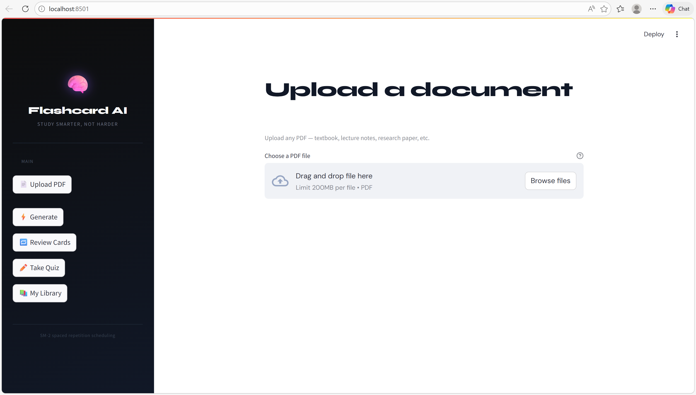
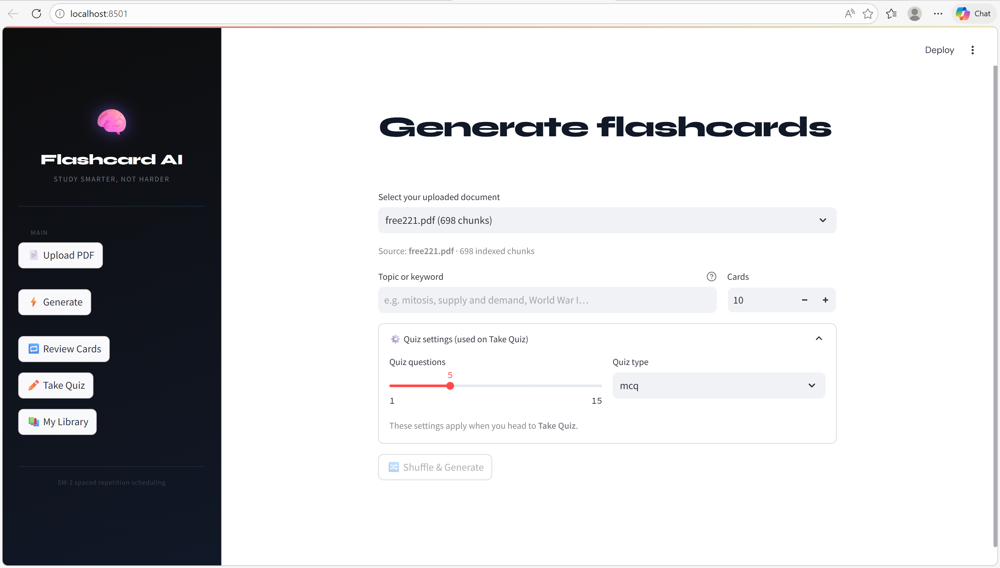
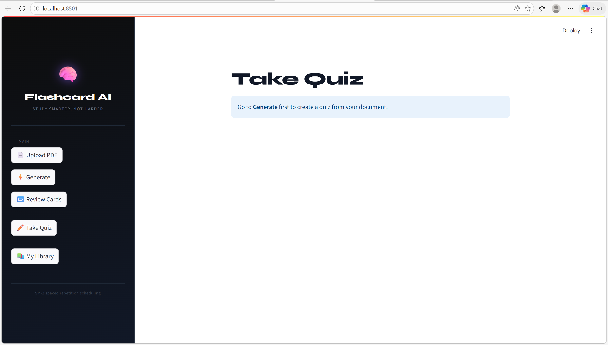
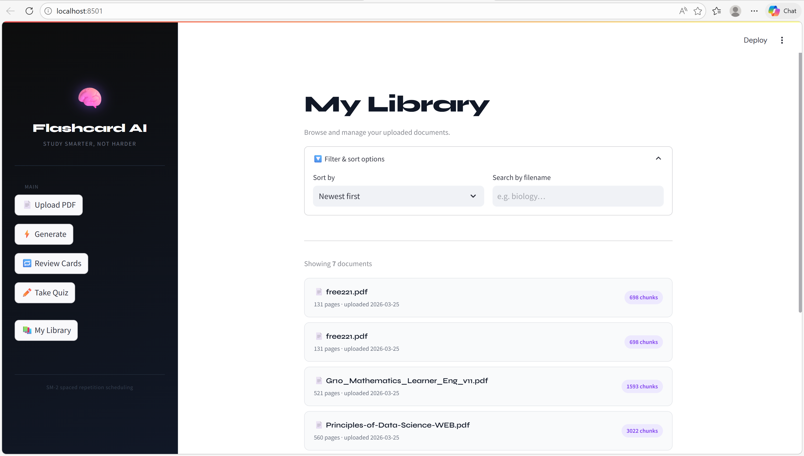
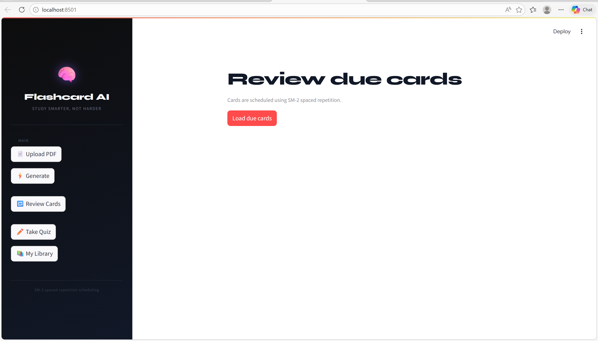

# Flashcard AI

AI-powered flashcard and quiz generator for students.
Upload any PDF textbook, lecture notes, research paper and get instant flashcards, multi-format quizzes, and a spaced repetition review system powered by Groq's free LLM API.

---

## Features

- **Upload any PDF** : no subject restrictions, works with any content
- **RAG pipeline** : chunks and embeds your PDF into ChromaDB, retrieves relevant context before every generation
- **Groq LLM** : fast, free `llama-3.3-70b-versatile` for flashcard and quiz generation
- **Multi-format quizzes** : MCQ, true/false, and short answer
- **SM-2 spaced repetition** : cards scheduled based on your recall ratings
- **SQuAD v2 evaluation** : Exact Match and F1 scoring to benchmark generation quality
- **FastAPI backend** : clean REST API, auto-documented at `/docs`
- **Streamlit frontend** : upload, generate, review, and quiz in one interface

---

## Tech stack

| Layer | Tool |
|---|---|
| LLM | Groq API (`llama-3.3-70b-versatile`) — free tier |
| Embeddings | `sentence-transformers/all-MiniLM-L6-v2` — local |
| Vector store | ChromaDB, per-document collections |
| Database | PostgreSQL (Docker) |
| Backend | FastAPI + SQLAlchemy |
| Frontend | Streamlit |
| Evaluation | SQuAD v2 — Exact Match + F1 |
| PDF parsing | PyMuPDF + LangChain text splitters |

---

## Project structure

```
flashcard-ai/
├── .env.example              # copy to .env and fill in your values
├── .gitignore
├── docker-compose.yml        # PostgreSQL container (port 5433)
├── requirements.txt
│
├── backend/
│   ├── __init__.py
│   ├── config.py             # all settings loaded from .env
│   ├── database.py           # SQLAlchemy engine + session
│   ├── models.py             # ORM tables + Pydantic schemas
│   ├── ingest.py             # PDF → chunks → embeddings → ChromaDB
│   ├── generator.py          # Groq API → flashcards + quizzes (JSON)
│   ├── scheduler.py          # SM-2 spaced repetition algorithm
│   └── main.py               # FastAPI routes
│
├── eval/
│   ├── __init__.py
│   ├── squad_eval.py         # SQuAD v2 EM + F1 evaluation harness
│   └── results/              # eval_report.json saved here
│
├── frontend/
│   └── app.py                # Streamlit UI (4 pages)
│
├── data/
│   ├── raw/                  # place your PDF(s) here
│   ├── squad/                # place squad_v2.json here
│   └── chroma_db/            # auto-created by ingest.py
│
└── tests/
    ├── __init__.py
    ├── test_scheduler.py     # SM-2 unit tests
    └── test_ingest.py        # chunking unit tests
```

---

## Quickstart

### Prerequisites

- Python 3.11+
- Docker Desktop
- Free Groq API key from [console.groq.com](https://console.groq.com)

### 1. Clone the repo

```bash
git clone https://github.com/HiteshAvula09/Flashcards-using-LLM.git
cd Flashcards-using-LLM
```

### 2. Create and activate a virtual environment

```bash
python -m venv .venv

# macOS / Linux
source .venv/bin/activate

# Windows
.venv\Scripts\activate
```

### 3. Install dependencies

```bash
pip install -r requirements.txt
```

### 4. Configure environment variables

```bash
cp .env.example .env
```

Open `.env` and fill in:

```
GROQ_API_KEY=your_groq_api_key_here
POSTGRES_PASSWORD=choose_a_password
SECRET_KEY=any_random_string
```

Everything else can stay as the defaults.

### 5. Start PostgreSQL

```bash
docker compose up -d
```

Runs on port `5433` to avoid conflicts with any locally installed PostgreSQL.

### 6. Verify setup

```bash
python -c "from backend.config import get_settings; s = get_settings(); print('Groq key loaded:', bool(s.groq_api_key)); print('DB URL:', s.database_url)"
```

### 7. Start the API server

```bash
uvicorn backend.main:app --reload --port 8000
```

API docs at: [http://localhost:8000/docs](http://localhost:8000/docs)

### 8. Start the Streamlit UI

```bash
# In a new terminal (keep uvicorn running)
streamlit run frontend/app.py
```

Opens at: [http://localhost:8501](http://localhost:8501)

### 9. Upload your PDF and generate

1. Go to **Upload PDF** — drag and drop any PDF
2. Go to **Generate** — select your document, enter a topic, click Generate
3. Go to **Take Quiz** — answer the generated questions
4. Go to **Review Cards** — spaced repetition mode

---

## Developer workflow (single PDF)

If you are the developer and want to ingest your PDF directly without the UI:

```bash
# Place your PDF in data/raw/
python -m backend.ingest --pdf data/raw/yourfile.pdf
```

Then go straight to Generate in the UI — skip the Upload page entirely.

---

## Run the SQuAD evaluation

```bash
# Place dev-v1.1.json in data/squad/
python -m eval.squad_eval --squad data/squad/dev-v1.1.json --n 100
```

Results saved to `eval/results/eval_report.json`:

```json
{
  "exact_match": 0.412,
  "f1": 0.587,
  "num_samples": 100,
  "model": "llama-3.3-70b-versatile"
}
```

---

## Run tests

```bash
pytest tests/ -v
```

---

## How it works

```
User uploads any PDF
        │
        ▼
PyMuPDF extracts text per page
        │
        ▼
LangChain splits into ~500 char chunks with 50 char overlap
        │
        ▼
sentence-transformers embeds each chunk → 384-dim vector
        │
        ▼
ChromaDB stores vectors in a collection named by document_id
        │
        ▼  (at generation time)
User enters a topic → embedded → top-6 chunks retrieved
        │
        ▼
Groq llama-3.3-70b receives context + structured prompt
        │
        ▼
Pydantic validates JSON output → flashcards + quiz questions
        │
        ▼
PostgreSQL stores cards, quiz sessions, SM-2 review state
```

---

## Environment variables reference

| Variable | Description | Default |
|---|---|---|
| `GROQ_API_KEY` | Your Groq API key | required |
| `GROQ_MODEL` | Model to use | `llama-3.3-70b-versatile` |
| `POSTGRES_USER` | DB username | `flashcard_user` |
| `POSTGRES_PASSWORD` | DB password | required |
| `POSTGRES_DB` | Database name | `flashcard_db` |
| `POSTGRES_HOST` | DB host | `localhost` |
| `POSTGRES_PORT` | DB port | `5433` |
| `CHROMA_PATH` | Vector store path | `data/chroma_db` |
| `EMBED_MODEL` | Embedding model name | `all-MiniLM-L6-v2` |
| `CHUNK_SIZE` | Characters per chunk | `500` |
| `CHUNK_OVERLAP` | Overlap between chunks | `50` |
| `SECRET_KEY` | App secret key | required |

---

## Swapping to Ollama (optional)

The LLM backend is designed to be swappable. To run fully offline with Ollama:

1. Install Ollama from [ollama.ai](https://ollama.ai)
2. Pull a model: `ollama pull llama3.2:3b`
3. In `backend/generator.py` replace the Groq client with:

```python
from langchain_community.llms import Ollama
llm = Ollama(model="llama3.2:3b")
```

All prompts, Pydantic validation, and FastAPI routes stay identical.

---
## Screenshots

### Upload PDF


### Generate flashcards


### Take quiz


### MyLibrary


### Review cards


## Challenges
1. ChromaDB batch size limit
ChromaDB enforced a maximum batch size of 166 on the installed version, causing ValueError during ingestion when the default batch of 500 was used. Fixed by reducing the upsert batch size to 100.
2. Groq model deprecation
The originally planned model llama3-70b-8192 was decommissioned by Groq mid-development. Migrated to llama-3.3-70b-versatile which required updating the model reference across config, README, and environment defaults.
3. PostgreSQL port conflict on Windows
Docker could not bind to the default PostgreSQL port 5432 because a native PostgreSQL installation was already listening on that port. Resolved by mapping the Docker container to port 5433 and updating all connection strings accordingly.
4. Docker volume credential mismatch
After changing the PostgreSQL password in .env, the Docker container kept rejecting connections because the old password was cached in the persistent volume. Required running docker compose down -v to wipe the volume and reinitialize with the correct credentials.
5. Special characters in .env passwords
Passwords containing # were silently truncated by the .env parser everything after # was treated as a comment. Resolved by using alphanumeric-only passwords in the .env file and documenting this as a known limitation for users.
6. Foreign key constraint on document upload
The documents table had a foreign key constraint on user_id referencing the users table. Since the app has no authentication yet, uploading with demo_user failed because that user didn't exist in the database. Fixed by making user_id nullable in the Document model to support anonymous uploads.
7. LLM JSON output reliability
Smaller or less capable models occasionally return malformed JSON with extra markdown fences or preamble text. Handled by implementing a _parse_json_safe() function that strips markdown fences before parsing, with per-item validation through Pydantic so one bad card doesn't drop the entire generation.
8. Per-document ChromaDB isolation
Initial design used a single hardcoded ChromaDB collection named "openstax", which meant all uploaded PDFs shared the same vector space and contaminated each other's retrieval results. Redesigned so each document gets its own collection named by its document_id, completely isolating retrieval per upload.

## License

MIT
